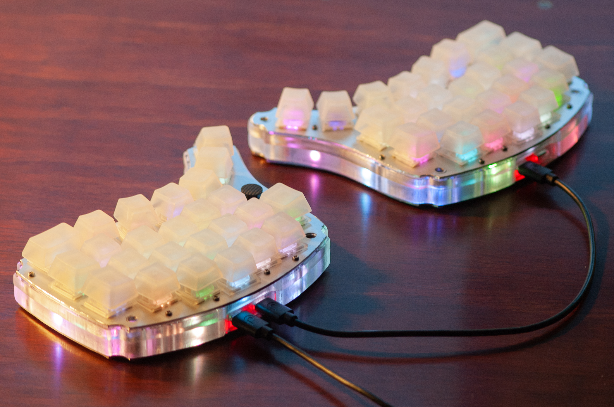

# Keyboards
This repository contains resources on various keyboard related things.

## CAD files for cases.

## PCB designs for controllers.

## Code for firmware.

## General purpose [keyboard wiki](https://github.com/rpbritton/keyboards/wiki).

